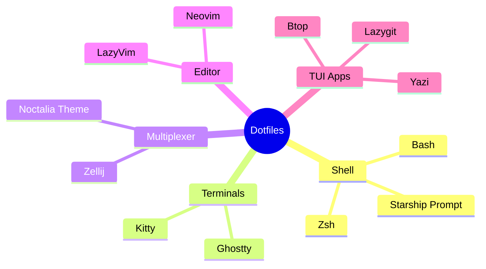

# 🌌 Noctalia Dotfiles (Ultimate 2026 Riced Setup)

[](#)
[](#)
[](#)
[](#)

Welcome to the ultimate terminal workspace. This repository contains a highly opinionated, brutally fast, and aesthetically stunning dotfiles setup centered around the **Noctalia** theme, **Ghostty/Kitty**, **Zellij**, and **LazyVim**. It transforms the terminal from a mere text prompt into a full-fledged IDE and lifestyle environment.

## 🗺️ Architecture Overview



## 🚀 Features & Workflow

- **The Core Engine**: Uses **Zellij** for persistent multiplexing and **Zoxide** (`z`) for frecency-based directory jumping.
- **The Visuals**: Driven by the custom **Noctalia** dark theme, unified across Ghostty, Zellij, and Neovim.
- **The IDE**: Includes a pre-configured **LazyVim** setup optimized for speed, utilizing `ripgrep` and `fd` for instant global searches.
- **The Lifestyle (`r/unixporn`)**: Features terminal-native Discord (`discordo`), Reddit (`reddix`), Pomodoro (`zeitx`), and audio visualization (`cava`).
- **TUI Mastery**: Replaces boring CLIs with beautiful interactive UIs: `lazygit`, `lazydocker`, `lazysql`, `lazynpm`, and `yazi`.

## ⚙️ Installation

> **Warning**
> This script uses `ln -sf` to symlink files into your `~` and `~/.config/` directories. It will overwrite existing configurations. Backup your current configs before running!

1. **Clone the repository:**
   ```bash
   git clone https://github.com/YOUR_USERNAME/dotfiles.git ~/dotfiles
   ```
2. **Run the installation script:**
   ```bash
   cd ~/dotfiles
   chmod +x install.sh
   ./install.sh
   ```
3. **Restart your terminal** or run `source ~/.zshrc`.

## 🛡️ Security
This repository has been audited to ensure no secrets or API keys are committed. A root `.gitignore` protects against accidental credential leaks.

## 📄 License
MIT License
